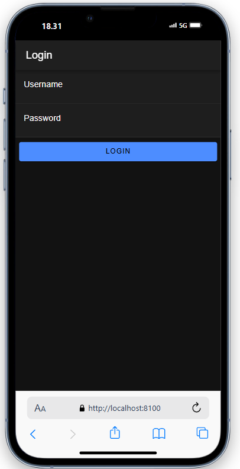

1. Pengguna Mengisi Form Login: 
- Pengguna memasukkan username dan password, kemudian menekan tombol Login.

2. Validasi Login (postMethod):

- Aplikasi mengirimkan data login (username dan password) ke server menggunakan postMethod.
- Server memverifikasi kredensial dan mengembalikan status login dan token autentikasi jika berhasil.

3. Penyimpanan Data Login:

- Jika login berhasil, token dan username disimpan dalam storage lokal menggunakan Capacitor Preferences.
- isAuthenticated diubah menjadi true, menandakan pengguna sudah terotentikasi.

4. Navigasi ke Halaman Utama:

- Setelah berhasil login, pengguna diarahkan ke halaman home.

5. Pengguna yang Belum Login:

- Jika pengguna mencoba mengakses halaman yang membutuhkan autentikasi (seperti halaman home) tanpa login,authGuard akan mengarahkan mereka kembali ke halaman login.

6. Logout:

- Ketika pengguna logout, AuthenticationService menghapus data login (token dan username) dari storage.
- isAuthenticated diatur kembali menjadi false, dan pengguna diarahkan ke halaman login.

7. AutoLogin:

- Jika pengguna sudah login sebelumnya, autoLoginGuard memastikan mereka tidak perlu login ulang dan langsung diarahkan ke halaman utama.

